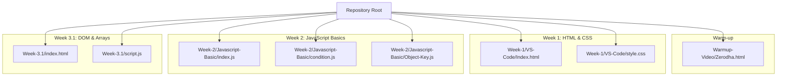
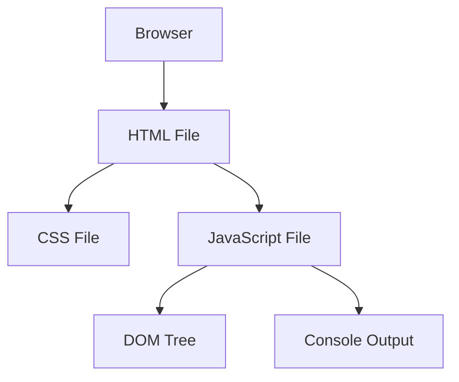
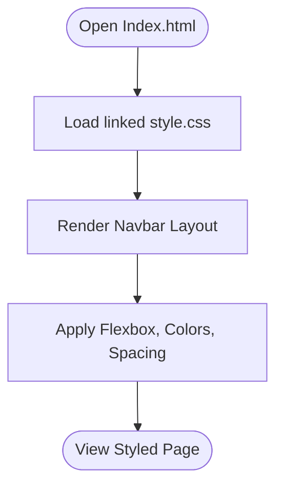
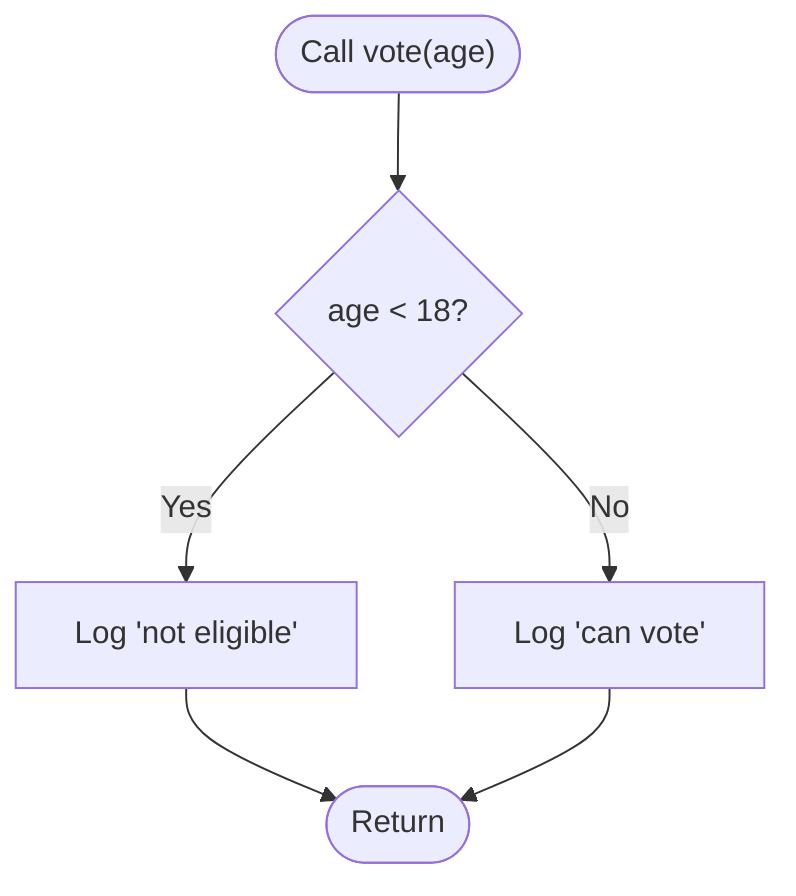
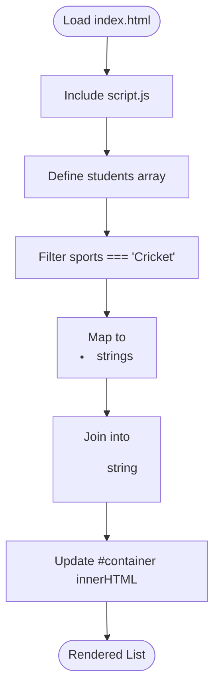
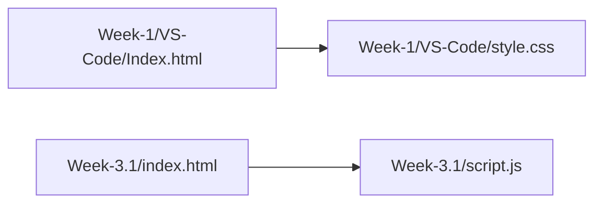

# Getting Started

<cite>
**Referenced Files in This Document**
- [Zerodha.html](file://Warmup-Video/Zerodha.html)
- [Index.html](file://Week-1/VS-Code/Index.html)
- [style.css](file://Week-1/VS-Code/style.css)
- [index.js](file://Week-2/Javascript-Basic/index.js)
- [condition.js](file://Week-2/Javascript-Basic/condition.js)
- [Object-Key.js](file://Week-2/Javascript-Basic/Object-Key.js)
- [index.html](file://Week-3.1/index.html)
- [script.js](file://Week-3.1/script.js)
</cite>

## Table of Contents
1. [Introduction](#introduction)
2. [Project Structure](#project-structure)
3. [Core Components](#core-components)
4. [Architecture Overview](#architecture-overview)
5. [Detailed Component Analysis](#detailed-component-analysis)
6. [Dependency Analysis](#dependency-analysis)
7. [Performance Considerations](#performance-considerations)
8. [Troubleshooting Guide](#troubleshooting-guide)
9. [Conclusion](#conclusion)

## Introduction
This cohort is a hands-on, project-based introduction to web development. You will learn by building real examples and progressively adding skills:
- Start with HTML/CSS fundamentals (layout, typography, navigation bars).
- Move into JavaScript basics (functions, conditions, objects).
- Practice DOM manipulation and data processing in the browser.

By the end, you will be comfortable reading and writing simple front-end code, running examples locally, and understanding how HTML, CSS, and JavaScript work together.

Learning objectives
- Build and style a basic webpage using HTML and CSS.
- Write simple JavaScript functions and conditionals.
- Work with JavaScript objects and arrays.
- Manipulate the DOM to render lists dynamically.
- Run examples locally in your browser and inspect output.

How to navigate weekly progression
- Warm-up: A simple static page to get familiar with the repo and your environment.
- Week 1: HTML structure and CSS styling for a navigation bar layout.
- Week 2: JavaScript basics—functions, conditions, and objects.
- Week 3.1: DOM manipulation and array methods to render content dynamically.

[No sources needed since this section provides general guidance]

## Project Structure
The repository is organized by weeks and topics. Each folder contains runnable examples that demonstrate the concepts for that week.

**Diagram sources**
- [Zerodha.html:1-42](file://Warmup-Video/Zerodha.html#L1-L42)
- [Index.html:1-46](file://Week-1/VS-Code/Index.html#L1-L46)
- [style.css:1-83](file://Week-1/VS-Code/style.css#L1-L83)
- [index.js:1-10](file://Week-2/Javascript-Basic/index.js#L1-L10)
- [condition.js:1-13](file://Week-2/Javascript-Basic/condition.js#L1-L13)
- [Object-Key.js:1-30](file://Week-2/Javascript-Basic/Object-Key.js#L1-L30)
- [index.html:1-16](file://Week-3.1/index.html#L1-L16)
- [script.js:1-27](file://Week-3.1/script.js#L1-L27)

**Section sources**
- [Zerodha.html:1-42](file://Warmup-Video/Zerodha.html#L1-L42)
- [Index.html:1-46](file://Week-1/VS-Code/Index.html#L1-L46)
- [style.css:1-83](file://Week-1/VS-Code/style.css#L1-L83)
- [index.js:1-10](file://Week-2/Javascript-Basic/index.js#L1-L10)
- [condition.js:1-13](file://Week-2/Javascript-Basic/condition.js#L1-L13)
- [Object-Key.js:1-30](file://Week-2/Javascript-Basic/Object-Key.js#L1-L30)
- [index.html:1-16](file://Week-3.1/index.html#L1-L16)
- [script.js:1-27](file://Week-3.1/script.js#L1-L27)

## Core Components
This section highlights the key files you will interact with during the cohort.

- Warm-up example
  - Zerodha.html: A simple static page demonstrating basic HTML structure and inline styles. Use it to verify your setup before moving on.

- Week 1: HTML and CSS
  - Index.html: Defines the page structure and links to an external stylesheet.
  - style.css: Styles the navigation bar layout using Flexbox, spacing, colors, and hover effects.

- Week 2: JavaScript Basics
  - index.js: Demonstrates defining and calling functions with parameters.
  - condition.js: Shows conditional logic with if/else based on input.
  - Object-Key.js: Introduces working with objects, nested properties, and function calls.

- Week 3.1: DOM and Arrays
  - index.html: Minimal HTML page that includes script.js and provides a container element.
  - script.js: Filters and maps an array of student objects, then renders a list into the DOM.

**Section sources**
- [Zerodha.html:1-42](file://Warmup-Video/Zerodha.html#L1-L42)
- [Index.html:1-46](file://Week-1/VS-Code/Index.html#L1-L46)
- [style.css:1-83](file://Week-1/VS-Code/style.css#L1-L83)
- [index.js:1-10](file://Week-2/Javascript-Basic/index.js#L1-L10)
- [condition.js:1-13](file://Week-2/Javascript-Basic/condition.js#L1-L13)
- [Object-Key.js:1-30](file://Week-2/Javascript-Basic/Object-Key.js#L1-L30)
- [index.html:1-16](file://Week-3.1/index.html#L1-L16)
- [script.js:1-27](file://Week-3.1/script.js#L1-L27)

## Architecture Overview
At a high level, each example follows a simple pattern:
- HTML defines the structure.
- CSS provides visual styling.
- JavaScript adds behavior and dynamic updates.

[No sources needed since this diagram shows conceptual workflow, not actual code structure]

## Detailed Component Analysis

### Warm-up: Static Page
What you will learn
- Basic HTML document structure.
- Inline styles for quick prototyping.
- How to open a local HTML file in a browser.

Key file
- Zerodha.html

Practical steps
- Open Zerodha.html in your browser.
- Inspect elements to see how inline styles are applied.

**Section sources**
- [Zerodha.html:1-42](file://Warmup-Video/Zerodha.html#L1-L42)

### Week 1: HTML and CSS Navigation Bar
What you will learn
- Semantic HTML structure for a header/navbar.
- External CSS linking from HTML.
- Flexbox layout for aligning items horizontally and vertically.
- Hover states and transitions for interactive feedback.

Key files
- Index.html
- style.css

Conceptual flow

**Diagram sources**
- [Index.html:1-46](file://Week-1/VS-Code/Index.html#L1-L46)
- [style.css:1-83](file://Week-1/VS-Code/style.css#L1-L83)

**Section sources**
- [Index.html:1-46](file://Week-1/VS-Code/Index.html#L1-L46)
- [style.css:1-83](file://Week-1/VS-Code/style.css#L1-L83)

### Week 2: JavaScript Basics
What you will learn
- Functions and parameters.
- Conditional statements.
- Working with objects and nested properties.

Key files
- index.js
- condition.js
- Object-Key.js

Conceptual flow for condition evaluation

**Diagram sources**
- [condition.js:1-13](file://Week-2/Javascript-Basic/condition.js#L1-L13)

**Section sources**
- [index.js:1-10](file://Week-2/Javascript-Basic/index.js#L1-L10)
- [condition.js:1-13](file://Week-2/Javascript-Basic/condition.js#L1-L13)
- [Object-Key.js:1-30](file://Week-2/Javascript-Basic/Object-Key.js#L1-L30)

### Week 3.1: DOM Manipulation and Array Methods
What you will learn
- Filtering and mapping arrays.
- Rendering dynamic content into the DOM.
- Connecting HTML and JavaScript via script tags.

Key files
- index.html
- script.js

Data processing flow

**Diagram sources**
- [index.html:1-16](file://Week-3.1/index.html#L1-L16)
- [script.js:1-27](file://Week-3.1/script.js#L1-L27)

**Section sources**
- [index.html:1-16](file://Week-3.1/index.html#L1-L16)
- [script.js:1-27](file://Week-3.1/script.js#L1-L27)

## Dependency Analysis
Relationships between files across weeks:
- Week 1: Index.html depends on style.css for visual presentation.
- Week 2: Standalone JavaScript files demonstrate core language features without dependencies.
- Week 3.1: index.html includes script.js; script.js manipulates the DOM created by index.html.

**Diagram sources**
- [Index.html:1-46](file://Week-1/VS-Code/Index.html#L1-L46)
- [style.css:1-83](file://Week-1/VS-Code/style.css#L1-L83)
- [index.html:1-16](file://Week-3.1/index.html#L1-L16)
- [script.js:1-27](file://Week-3.1/script.js#L1-L27)

**Section sources**
- [Index.html:1-46](file://Week-1/VS-Code/Index.html#L1-L46)
- [style.css:1-83](file://Week-1/VS-Code/style.css#L1-L83)
- [index.html:1-16](file://Week-3.1/index.html#L1-L16)
- [script.js:1-27](file://Week-3.1/script.js#L1-L27)

## Performance Considerations
- Keep CSS modular and avoid excessive inline styles as projects grow.
- Prefer external stylesheets and scripts for better caching and readability.
- In JavaScript, prefer functional array methods (filter/map) for clarity and maintainability.
- Minimize heavy operations in the main thread; keep DOM updates minimal and batched where possible.

[No sources needed since this section provides general guidance]

## Troubleshooting Guide
Common issues and resolutions
- Blank page when opening HTML
  - Ensure the file path is correct and the file is saved.
  - Verify that any linked assets (CSS/images) exist in the expected locations.

- CSS not applying
  - Confirm the link tag in HTML points to the correct CSS file path.
  - Check the browser’s developer tools for network errors or 404s.

- JavaScript not running
  - Make sure the script tag references the correct file path.
  - Open the browser console to check for syntax or runtime errors.

- DOM elements not updating
  - Verify the target element exists in the HTML before manipulating it.
  - Ensure the script runs after the DOM is ready (e.g., placing script at the end of body or using appropriate loading strategies).

- Images not showing
  - Check image paths and ensure files are present in the same directory or correctly referenced.

**Section sources**
- [Index.html:1-46](file://Week-1/VS-Code/Index.html#L1-L46)
- [style.css:1-83](file://Week-1/VS-Code/style.css#L1-L83)
- [index.html:1-16](file://Week-3.1/index.html#L1-L16)
- [script.js:1-27](file://Week-3.1/script.js#L1-L27)

## Conclusion
You now have a clear roadmap to progress through the cohort:
- Start with the warm-up to validate your environment.
- Build and style a navigation bar in Week 1.
- Learn core JavaScript concepts in Week 2.
- Practice DOM manipulation and array methods in Week 3.1.

Keep experimenting, run examples locally, and use the browser’s developer tools to explore and debug. As you advance, these foundational skills will support more complex front-end and back-end topics.

[No sources needed since this section summarizes without analyzing specific files]