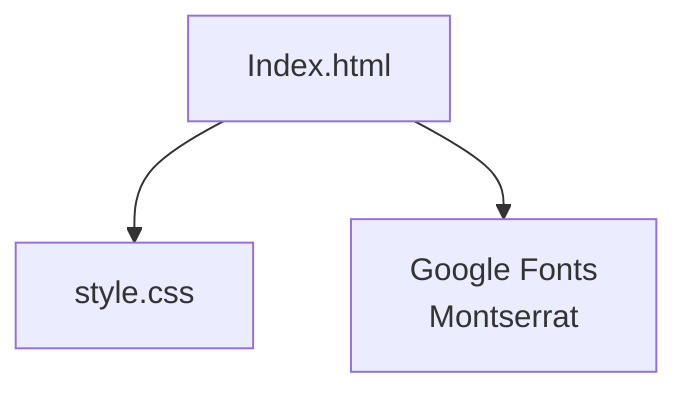
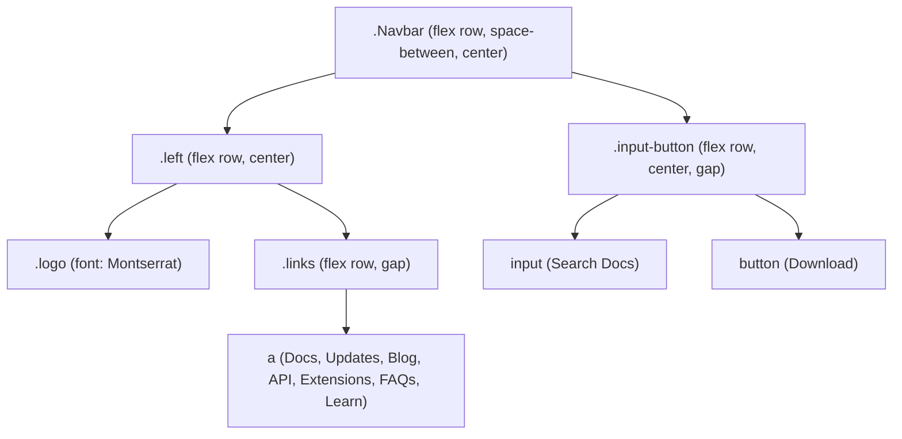
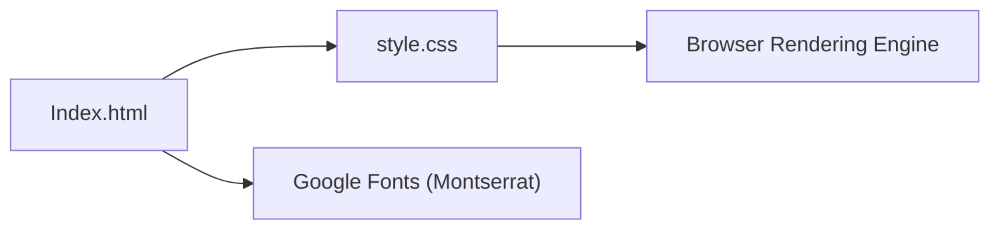

# Week 1: HTML & CSS Fundamentals

<cite>
**Referenced Files in This Document**
- [Index.html](file://Week-1/VS-Code/Index.html)
- [style.css](file://Week-1/VS-Code/style.css)
</cite>

## Table of Contents
1. [Introduction](#introduction)
2. [Project Structure](#project-structure)
3. [Core Components](#core-components)
4. [Architecture Overview](#architecture-overview)
5. [Detailed Component Analysis](#detailed-component-analysis)
6. [Dependency Analysis](#dependency-analysis)
7. [Performance Considerations](#performance-considerations)
8. [Troubleshooting Guide](#troubleshooting-guide)
9. [Conclusion](#conclusion)

## Introduction
This document covers Week 1 fundamentals of HTML and CSS, focusing on building a responsive navigation bar with Flexbox, semantic markup, modern CSS practices, Google Fonts integration (Montserrat), and interactive hover effects. It also explains the flexbox properties used for alignment and spacing and provides practical examples drawn from the VS Code website recreation project.

## Project Structure
The Week 1 project is organized into two primary files:
- Index.html: The semantic structure of the page, including the navigation bar, logo, links, search input, and buttons.
- style.css: All styling rules, including Flexbox layout, typography, colors, spacing, and hover transitions.

**Diagram sources**
- [Index.html:1-46](file://Week-1/VS-Code/Index.html#L1-L46)
- [style.css:1-83](file://Week-1/VS-Code/style.css#L1-L83)

**Section sources**
- [Index.html:1-46](file://Week-1/VS-Code/Index.html#L1-L46)
- [style.css:1-83](file://Week-1/VS-Code/style.css#L1-L83)

## Core Components
- Semantic HTML structure:
  - Head section includes title, stylesheet link, and Google Fonts link for Montserrat.
  - Body contains a Navbar container with left group (logo + links) and right group (search input + button).
  - A separate Download button exists outside the navbar.
- Responsive navigation bar using Flexbox:
  - Navbar uses Flexbox to distribute space between left and right groups and vertically center items.
  - Left group aligns logo and links horizontally.
  - Links are laid out horizontally with consistent gaps.
  - Right group aligns search input and button horizontally with a small gap.
- Typography and fonts:
  - Montserrat font family applied via Google Fonts.
  - Font weight and optical sizing configured for readability.
- Interactive hover effects:
  - Hover state adds border color change and box-shadow transition for enhanced feedback.

**Section sources**
- [Index.html:1-46](file://Week-1/VS-Code/Index.html#L1-L46)
- [style.css:1-83](file://Week-1/VS-Code/style.css#L1-L83)

## Architecture Overview
The navigation component follows a simple parent-child Flexbox hierarchy:
- .Navbar is the root flex container that distributes space between .left and .input-button.
- .left is a nested flex container that aligns .logo and .links horizontally.
- .links is a flex container that arranges anchor elements horizontally with gaps.
- .input-button is a flex container that aligns the search input and button horizontally.

**Diagram sources**
- [Index.html:13-39](file://Week-1/VS-Code/Index.html#L13-L39)
- [style.css:2-70](file://Week-1/VS-Code/style.css#L2-L70)

## Detailed Component Analysis

### Navigation Bar Layout with Flexbox
- Root container (.Navbar):
  - Uses display: flex to enable Flexbox layout.
  - justify-content: space-between pushes the left group to the far left and the right group to the far right.
  - align-items: center vertically centers all direct children within the navbar.
  - Padding and background color provide visual separation and contrast.
  - Box shadow adds subtle elevation.
- Left group (.left):
  - display: flex aligns the logo and links horizontally.
  - align-items: center ensures vertical alignment between logo text and links.
- Links (.links):
  - display: flex lays out anchor elements in a row.
  - gap: 8px creates consistent spacing between individual links.
  - Color set to a neutral gray for non-active states.
- Right group (.input-button):
  - display: flex aligns the search input and button horizontally.
  - align-items: center vertically centers them.
  - gap: 5px provides a small space between input and button.

Practical example references:
- Navbar flex setup and spacing: [style.css:2-17](file://Week-1/VS-Code/style.css#L2-L17)
- Left group alignment: [style.css:22-27](file://Week-1/VS-Code/style.css#L22-L27)
- Links horizontal layout and gap: [style.css:41-51](file://Week-1/VS-Code/style.css#L41-L51)
- Right group alignment and gap: [style.css:61-70](file://Week-1/VS-Code/style.css#L61-L70)

**Section sources**
- [style.css:2-17](file://Week-1/VS-Code/style.css#L2-L17)
- [style.css:22-27](file://Week-1/VS-Code/style.css#L22-L27)
- [style.css:41-51](file://Week-1/VS-Code/style.css#L41-L51)
- [style.css:61-70](file://Week-1/VS-Code/style.css#L61-L70)

### Typography and Google Fonts Integration
- Montserrat font family is imported via Google Fonts in the head section.
- Font properties applied to logo and links include:
  - font-family: Montserrat
  - font-optical-sizing: auto
  - font-weight: 300
  - font-style: normal
- These settings ensure consistent, readable typography across the navigation.

Practical example references:
- Google Fonts link: [Index.html:7](file://Week-1/VS-Code/Index.html#L7)
- Logo typography: [style.css:30-38](file://Week-1/VS-Code/style.css#L30-L38)
- Links typography: [style.css:41-46](file://Week-1/VS-Code/style.css#L41-L46)

**Section sources**
- [Index.html:7](file://Week-1/VS-Code/Index.html#L7)
- [style.css:30-38](file://Week-1/VS-Code/style.css#L30-L38)
- [style.css:41-46](file://Week-1/VS-Code/style.css#L41-L46)

### Interactive Hover Effects
- The standalone Download button wrapper (.Download) applies:
  - Background color and text color for contrast.
  - Cursor pointer to indicate interactivity.
  - Transition on box-shadow and background-color for smooth animation.
- On hover (.Download:hover):
  - Border color changes to grey.
  - Box-shadow expands outward with a white glow effect.

Practical example references:
- Download wrapper styles and transitions: [style.css:71-79](file://Week-1/VS-Code/style.css#L71-L79)
- Hover state enhancements: [style.css:80-83](file://Week-1/VS-Code/style.css#L80-L83)

**Section sources**
- [style.css:71-83](file://Week-1/VS-Code/style.css#L71-L83)

### Semantic HTML Structure
- The page uses a clear structure:
  - Head includes title, stylesheet, and Google Fonts link.
  - Body contains a single Navbar div with logical grouping:
    - Left side: logo and navigation links.
    - Right side: search input and download button.
  - An additional Download button exists outside the navbar for emphasis.
- Anchor elements represent navigation destinations.
- Input element represents a search field with placeholder text.

Practical example references:
- Head and external resources: [Index.html:4-9](file://Week-1/VS-Code/Index.html#L4-L9)
- Navbar structure and content: [Index.html:13-39](file://Week-1/VS-Code/Index.html#L13-L39)
- Standalone Download button: [Index.html:40-42](file://Week-1/VS-Code/Index.html#L40-L42)

**Section sources**
- [Index.html:4-9](file://Week-1/VS-Code/Index.html#L4-L9)
- [Index.html:13-39](file://Week-1/VS-Code/Index.html#L13-L39)
- [Index.html:40-42](file://Week-1/VS-Code/Index.html#L40-L42)

## Dependency Analysis
- Index.html depends on:
  - style.css for all visual styling.
  - Google Fonts CDN for Montserrat typography.
- style.css depends on:
  - DOM classes defined in Index.html (.Navbar, .left, .logo, .links, .input-button, .Download).
  - Browser rendering engine for Flexbox layout and transitions.

**Diagram sources**
- [Index.html:4-9](file://Week-1/VS-Code/Index.html#L4-L9)
- [style.css:2-83](file://Week-1/VS-Code/style.css#L2-L83)

**Section sources**
- [Index.html:4-9](file://Week-1/VS-Code/Index.html#L4-L9)
- [style.css:2-83](file://Week-1/VS-Code/style.css#L2-L83)

## Performance Considerations
- Prefer using gap instead of margins for spacing between flex items to reduce complexity and improve maintainability.
- Use CSS transitions sparingly; only animate properties that are inexpensive to repaint (e.g., transform, opacity, box-shadow).
- Avoid overly large box-shadows or frequent heavy animations on hover to prevent jank on low-end devices.
- Keep font loading efficient by leveraging Google Fonts with appropriate subsets and weights.

[No sources needed since this section provides general guidance]

## Troubleshooting Guide
Common CSS challenges and solutions:
- Flexbox not distributing space as expected:
  - Ensure the parent container has display: flex and check justify-content and align-items values.
  - Verify child elements are direct descendants of the flex container.
- Links overlapping or misaligned:
  - Confirm .links has display: flex and appropriate gap value.
  - Check that anchor elements do not have conflicting inline styles.
- Hover effects not appearing:
  - Verify the correct class selector is applied and that the hover pseudo-class targets the intended element.
  - Ensure transitions are declared on the base state, not just the hover state.
- Typography not loading:
  - Confirm the Google Fonts link is correctly included in the head section.
  - Check network requests to ensure the font resource loads successfully.

**Section sources**
- [style.css:2-17](file://Week-1/VS-Code/style.css#L2-L17)
- [style.css:41-51](file://Week-1/VS-Code/style.css#L41-L51)
- [style.css:71-83](file://Week-1/VS-Code/style.css#L71-L83)
- [Index.html:7](file://Week-1/VS-Code/Index.html#L7)

## Conclusion
This Week 1 documentation demonstrates how to build a clean, responsive navigation bar using Flexbox, apply semantic HTML structure, integrate Google Fonts for consistent typography, and implement interactive hover effects. By following the provided patterns and best practices, beginners can create accessible and maintainable front-end components.

[No sources needed since this section summarizes without analyzing specific files]