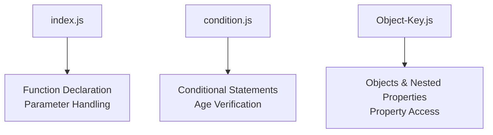
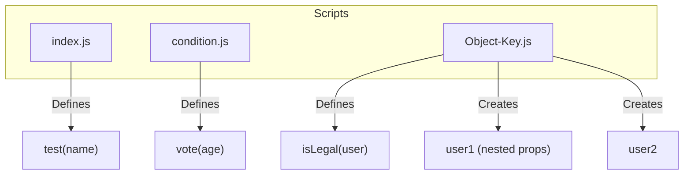
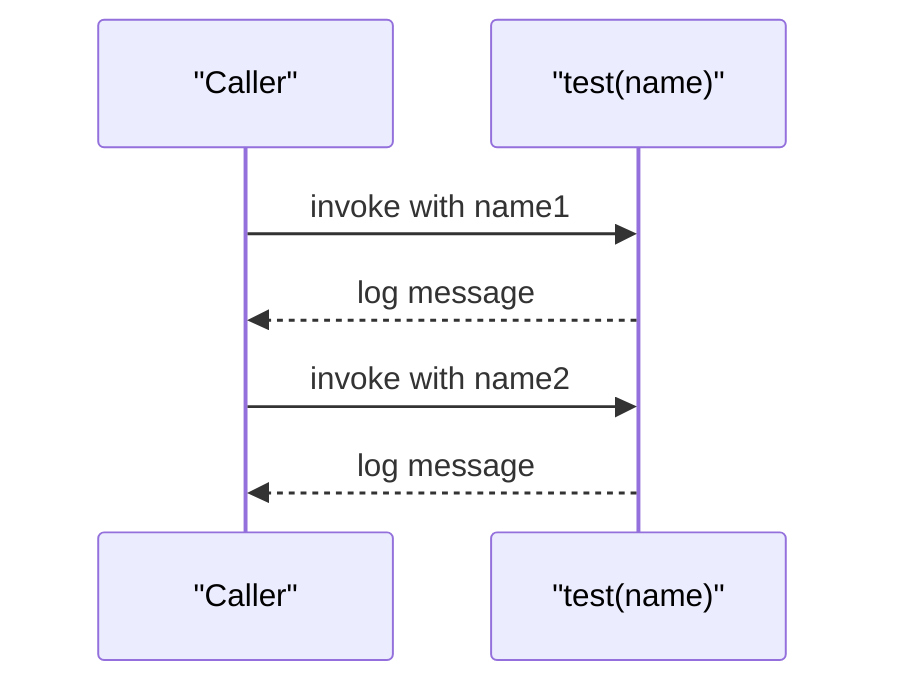
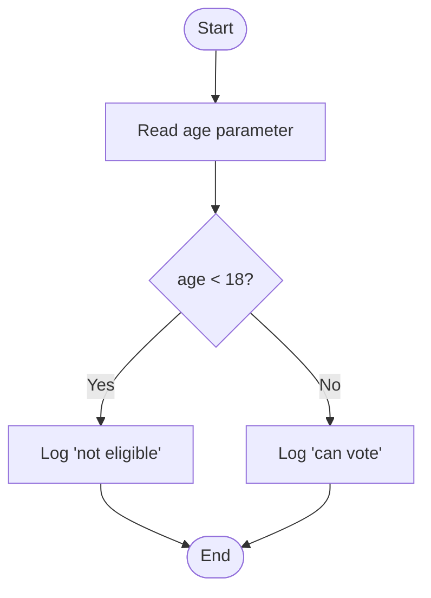
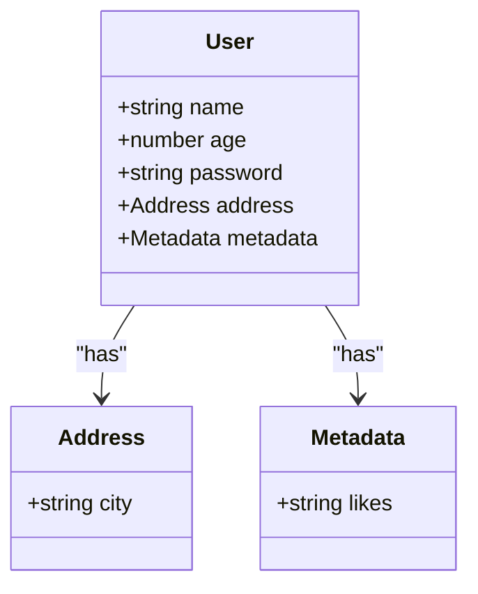
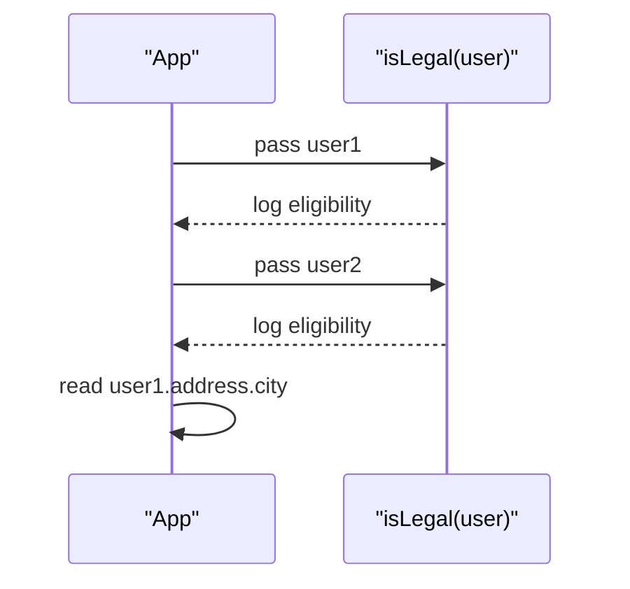
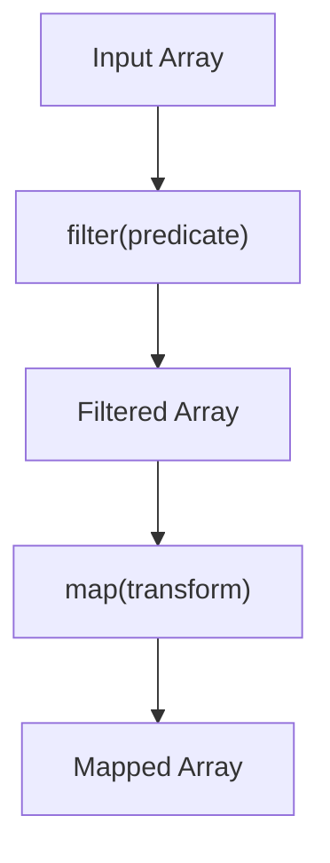
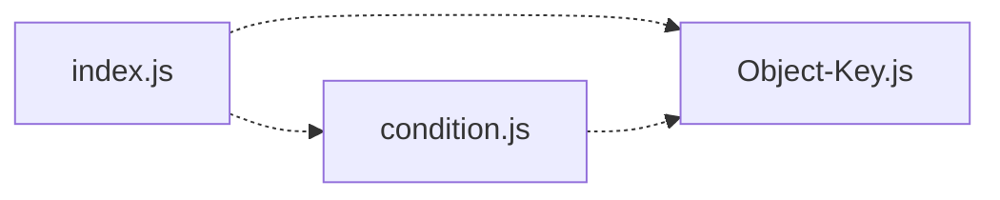

# Week 2: JavaScript Basics

<cite>
**Referenced Files in This Document**
- [index.js](file://Week-2/Javascript-Basic/index.js)
- [condition.js](file://Week-2/Javascript-Basic/condition.js)
- [Object-Key.js](file://Week-2/Javascript-Basic/Object-Key.js)
</cite>

## Table of Contents
1. [Introduction](#introduction)
2. [Project Structure](#project-structure)
3. [Core Components](#core-components)
4. [Architecture Overview](#architecture-overview)
5. [Detailed Component Analysis](#detailed-component-analysis)
6. [Dependency Analysis](#dependency-analysis)
7. [Performance Considerations](#performance-considerations)
8. [Troubleshooting Guide](#troubleshooting-guide)
9. [Conclusion](#conclusion)

## Introduction
This document explains the core JavaScript fundamentals demonstrated in Week 2, focusing on:
- Function declarations and parameter handling
- Conditional statements and decision making
- Object property manipulation, including nested objects
- Data processing patterns using filter and map (conceptual guidance)
- Scope, parameter passing, and object-oriented basics for beginners

The examples are grounded in three files: index.js, condition.js, and Object-Key.js.

## Project Structure
The relevant code is organized under a single folder with three focused scripts:
- index.js: Demonstrates function declarations and parameters
- condition.js: Demonstrates if-else logic for age-based decisions
- Object-Key.js: Demonstrates object properties, nested objects, and conditional checks on object data

**Section sources**
- [index.js:1-10](file://Week-2/Javascript-Basic/index.js#L1-L10)
- [condition.js:1-13](file://Week-2/Javascript-Basic/condition.js#L1-L13)
- [Object-Key.js:1-30](file://Week-2/Javascript-Basic/Object-Key.js#L1-L30)

## Core Components
- Functions and Parameters: The script defines a simple function that accepts one parameter and logs it to the console. It demonstrates how to pass variables as arguments.
- Conditionals: A function evaluates an age parameter and prints eligibility based on a threshold.
- Objects and Nested Properties: Two user objects are created; one includes nested address and metadata properties. A function checks voting eligibility using the age property.

Key concepts covered:
- Function declaration syntax
- Parameter passing by value
- if-else branching
- Object literal creation
- Dot notation for property access
- Nested object traversal

**Section sources**
- [index.js:1-10](file://Week-2/Javascript-Basic/index.js#L1-L10)
- [condition.js:1-13](file://Week-2/Javascript-Basic/condition.js#L1-L13)
- [Object-Key.js:1-30](file://Week-2/Javascript-Basic/Object-Key.js#L1-L30)

## Architecture Overview
At a high level, each file is self-contained and focuses on a specific concept. There is no shared module or import/export structure; instead, each script can be executed independently to demonstrate its topic.

**Diagram sources**
- [index.js:1-10](file://Week-2/Javascript-Basic/index.js#L1-L10)
- [condition.js:1-13](file://Week-2/Javascript-Basic/condition.js#L1-L13)
- [Object-Key.js:1-30](file://Week-2/Javascript-Basic/Object-Key.js#L1-L30)

## Detailed Component Analysis

### Functions and Parameters (index.js)
- Purpose: Demonstrate declaring a function with a parameter and invoking it with different values.
- Behavior:
  - Defines a function that takes a name parameter and logs a greeting.
  - Declares two string variables and passes them to the function.
- Concepts:
  - Function declaration vs invocation
  - Parameter binding at call time
  - String concatenation in logging

**Diagram sources**
- [index.js:1-10](file://Week-2/Javascript-Basic/index.js#L1-L10)

**Section sources**
- [index.js:1-10](file://Week-2/Javascript-Basic/index.js#L1-L10)

### Conditional Statements and Decision Making (condition.js)
- Purpose: Demonstrate if-else branching based on an age parameter.
- Behavior:
  - Defines vote(age) which prints whether a person can vote depending on age.
  - Invokes vote with two sample ages.
- Concepts:
  - Comparison operators
  - Branching logic
  - Age verification pattern

**Diagram sources**
- [condition.js:1-13](file://Week-2/Javascript-Basic/condition.js#L1-L13)

**Section sources**
- [condition.js:1-13](file://Week-2/Javascript-Basic/condition.js#L1-L13)

### Object Property Manipulation (Object-Key.js)
- Purpose: Demonstrate creating objects, accessing properties, working with nested objects, and checking conditions on object fields.
- Behavior:
  - Defines isLegal(user) to check voting eligibility using user.age.
  - Creates user1 with nested address and metadata, and user2 with basic properties.
  - Calls isLegal for both users and accesses a nested property via dot notation.
- Concepts:
  - Object literals
  - Dot notation for property access
  - Nested object traversal
  - Passing objects as parameters

**Diagram sources**
- [Object-Key.js:9-19](file://Week-2/Javascript-Basic/Object-Key.js#L9-L19)

**Diagram sources**
- [Object-Key.js:1-7](file://Week-2/Javascript-Basic/Object-Key.js#L1-L7)
- [Object-Key.js:27-30](file://Week-2/Javascript-Basic/Object-Key.js#L27-L30)

**Section sources**
- [Object-Key.js:1-30](file://Week-2/Javascript-Basic/Object-Key.js#L1-L30)

### Conceptual Overview: Arrays, filter, and map
While not present in the provided files, these are essential data-processing patterns you will use frequently:
- filter(array, predicate): Returns a new array with elements that satisfy a condition.
- map(array, transform): Returns a new array with transformed elements.

Conceptual flow:

[No sources needed since this diagram shows conceptual workflow, not actual code structure]

## Dependency Analysis
- Each script is independent with no imports or exports between them.
- Coupling is minimal; cohesion within each file is high around a single concept.
- External dependencies: None (console-based output only).

**Diagram sources**
- [index.js:1-10](file://Week-2/Javascript-Basic/index.js#L1-L10)
- [condition.js:1-13](file://Week-2/Javascript-Basic/condition.js#L1-L13)
- [Object-Key.js:1-30](file://Week-2/Javascript-Basic/Object-Key.js#L1-L30)

**Section sources**
- [index.js:1-10](file://Week-2/Javascript-Basic/index.js#L1-L10)
- [condition.js:1-13](file://Week-2/Javascript-Basic/condition.js#L1-L13)
- [Object-Key.js:1-30](file://Week-2/Javascript-Basic/Object-Key.js#L1-L30)

## Performance Considerations
- These scripts perform constant-time operations per call; performance is not a concern at this scale.
- For larger datasets, prefer native array methods like filter and map over manual loops for readability and maintainability.
- Avoid unnecessary object property lookups inside tight loops; cache references when needed.

[No sources needed since this section provides general guidance]

## Troubleshooting Guide
Common issues and resolutions:
- TypeError when accessing nested properties: Ensure intermediate objects exist before accessing deeper properties. Validate presence of parent keys before reading child keys.
- Unexpected behavior with comparisons: Verify types of values being compared (strings vs numbers) to avoid coercion surprises.
- Logging confusion: Remember that console.log outputs synchronously in most environments; order of calls matters for debugging.

Practical tips:
- Add defensive checks for optional nested properties before accessing them.
- Use consistent naming conventions for clarity.
- When extending objects, consider adding helper functions to encapsulate repeated checks.

**Section sources**
- [Object-Key.js:1-30](file://Week-2/Javascript-Basic/Object-Key.js#L1-L30)

## Conclusion
These three scripts provide a solid foundation for JavaScript fundamentals:
- Functions and parameters enable reusable logic.
- Conditional statements allow decision-making based on input.
- Objects and nested properties model real-world entities and support structured data access.
As you progress, apply these patterns to arrays using filter and map for robust data processing pipelines.

[No sources needed since this section summarizes without analyzing specific files]