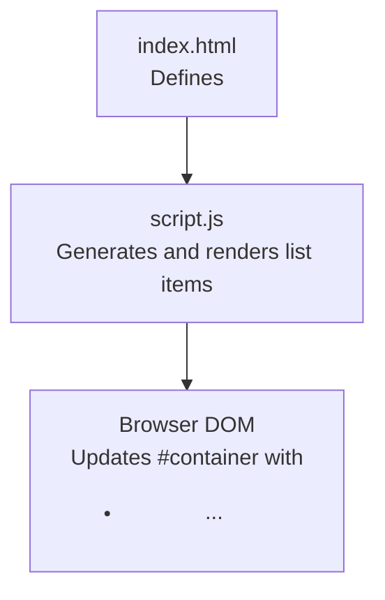
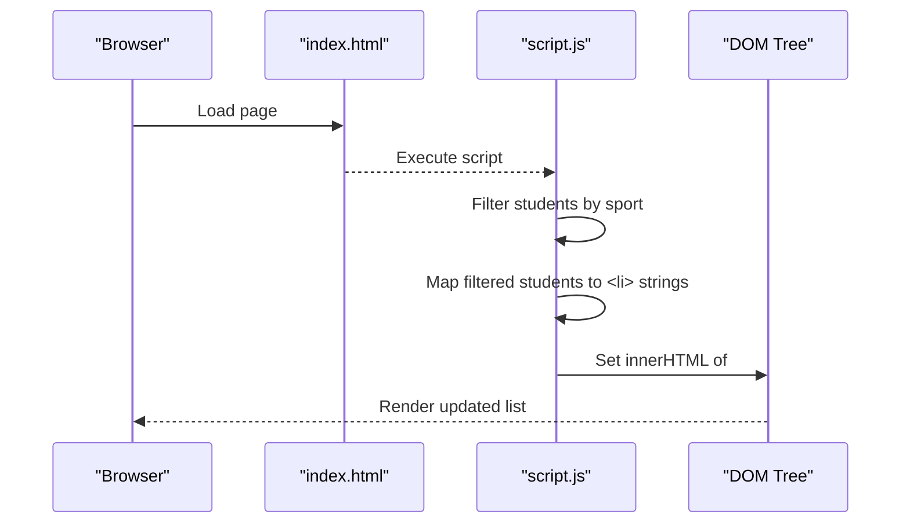
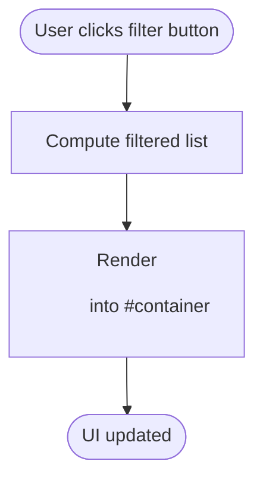
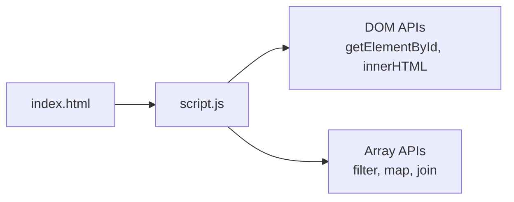

# Week 3.1: DOM Manipulation

<cite>
**Referenced Files in This Document**
- [index.html](file://Week-3.1/index.html)
- [script.js](file://Week-3.1/script.js)
</cite>

## Table of Contents
1. [Introduction](#introduction)
2. [Project Structure](#project-structure)
3. [Core Components](#core-components)
4. [Architecture Overview](#architecture-overview)
5. [Detailed Component Analysis](#detailed-component-analysis)
6. [Dependency Analysis](#dependency-analysis)
7. [Performance Considerations](#performance-considerations)
8. [Troubleshooting Guide](#troubleshooting-guide)
9. [Conclusion](#conclusion)

## Introduction
This document explains DOM manipulation techniques using a small, focused example that demonstrates dynamic content generation from JavaScript arrays, filtering and mapping operations on data structures, and real-time updates to the page without reloads. It also covers the relationship between HTML structure and JavaScript manipulation, event handling patterns, and dynamic element creation. Practical examples include filtering student data by sports, generating HTML lists dynamically, and updating the UI interactively. Finally, it provides guidance on performance considerations, best practices for efficient manipulation, and common pitfalls for beginners.

## Project Structure
The project consists of two files:
- An HTML file that defines a minimal page with a container element where dynamic content will be rendered.
- A JavaScript file that holds sample student data, filters and maps it into HTML list items, and injects the result into the DOM.

**Diagram sources**
- [index.html:9-13](file://Week-3.1/index.html#L9-L13)
- [script.js:1-27](file://Week-3.1/script.js#L1-L27)

**Section sources**
- [index.html:1-16](file://Week-3.1/index.html#L1-L16)
- [script.js:1-27](file://Week-3.1/script.js#L1-L27)

## Core Components
- Data source: an array of student objects containing identifiers, names, and sports.
- Filtering pipeline: selects students based on criteria (e.g., specific sport).
- Mapping pipeline: converts filtered objects into HTML list item strings.
- DOM injection: creates a list element and populates it with generated items.

Key responsibilities:
- Transform raw data into user-visible markup efficiently.
- Keep the HTML structure simple so JavaScript can target a single mount point.
- Provide a foundation for adding interactivity (e.g., buttons to filter by sport).

**Section sources**
- [script.js:1-20](file://Week-3.1/script.js#L1-L20)

## Architecture Overview
At runtime, the browser loads the HTML, then executes the script. The script reads the student dataset, computes a filtered and mapped set of list items, and writes them into the container div. This is a one-way data flow from data to DOM.

**Diagram sources**
- [index.html:9-13](file://Week-3.1/index.html#L9-L13)
- [script.js:9-19](file://Week-3.1/script.js#L9-L19)

## Detailed Component Analysis

### Data Model: Student Array
- Purpose: Holds a collection of student records used to generate UI elements.
- Shape: Each record includes an identifier, name, and sport.
- Complexity: O(n) for basic operations like filtering or mapping over the array.

Best practices:
- Keep data immutable when possible; create new arrays via filter/map rather than mutating existing ones.
- Validate IDs and ensure consistent types before processing.

**Section sources**
- [script.js:1-7](file://Week-3.1/script.js#L1-L7)

### Filtering and Mapping Pipeline
- Filtering: Selects students matching a condition (for example, a specific sport).
- Mapping: Converts each selected student into an HTML list item string.
- Composition: Chaining filter followed by map yields a concise transformation pipeline.

Complexity:
- Time: O(n) for filter + O(k) for map where k ≤ n.
- Space: O(k) for the resulting array of strings.

Common pitfalls:
- Using string concatenation inside loops instead of join() can degrade performance.
- Forgetting to sanitize user-provided values can lead to XSS risks.

**Section sources**
- [script.js:9-13](file://Week-3.1/script.js#L9-L13)

### DOM Injection and Rendering
- Mount point: A single div with a known ID serves as the insertion target.
- Rendering strategy: Build a complete HTML string and assign it to innerHTML once per update.
- Result: The browser parses and inserts the markup into the DOM tree.

Considerations:
- Batch updates: Prefer writing to innerHTML once rather than repeatedly appending nodes.
- Avoid excessive reflows/repaints by minimizing intermediate DOM mutations.

**Section sources**
- [index.html:11](file://Week-3.1/index.html#L11)
- [script.js:17-19](file://Week-3.1/script.js#L17-L19)

### Interactive Updates and Event Handling Patterns
While the current example performs a static render, you can extend it with interactive controls:
- Add buttons or dropdowns to select different sports.
- Attach click/change listeners to trigger re-filtering and re-rendering.
- Update only the container’s content to avoid full-page reloads.

Recommended pattern:
- Separate state (the student array and current filter) from rendering logic.
- On user interaction, compute new state, then call a render function that updates the DOM.

Example workflow:

[No sources needed since this diagram shows conceptual workflow, not actual code structure]

### Dynamic Element Creation Alternatives
Beyond innerHTML, you can create elements programmatically:
- Use createElement and appendChild to build nodes.
- Use DocumentFragment to batch multiple insertions and reduce layout thrashing.

When to choose which approach:
- innerHTML: Fast for large static chunks; convenient but less safe if untrusted data is involved.
- createElement + DocumentFragment: Safer and more granular control; better for complex interactions.

**Section sources**
- [script.js:17-19](file://Week-3.1/script.js#L17-L19)

## Dependency Analysis
The JavaScript module depends on the HTML structure to locate the mount point. There are no external libraries; all behavior is implemented with native DOM APIs and array methods.

**Diagram sources**
- [index.html:9-13](file://Week-3.1/index.html#L9-L13)
- [script.js:9-19](file://Week-3.1/script.js#L9-L19)

**Section sources**
- [index.html:1-16](file://Week-3.1/index.html#L1-L16)
- [script.js:1-27](file://Week-3.1/script.js#L1-L27)

## Performance Considerations
- Batch DOM writes: Assign innerHTML once per update instead of multiple appends.
- Minimize layout thrashing: Read layout properties (like offsetHeight) infrequently and avoid interleaving reads and writes.
- Prefer DocumentFragment for many child nodes to reduce reflows.
- Debounce frequent events (e.g., input/search) to limit re-renders.
- Avoid unnecessary string concatenation; use join() on arrays of strings.
- Sanitize any user-generated content before injecting into the DOM to prevent XSS.

[No sources needed since this section provides general guidance]

## Troubleshooting Guide
Common issues and resolutions:
- Container not found: Ensure the script runs after the DOM is ready or place the script at the end of the body. Verify the selector matches the element ID.
- Empty list rendered: Check filter conditions and data shape; confirm that the sport field exists and matches expected values.
- Unexpected results from numeric checks: Comparing string IDs with modulo arithmetic may produce NaN; convert IDs to numbers explicitly if needed.
- Security concerns: Never inject unsanitized user input directly into innerHTML.

Relevant implementation points:
- Selector usage and innerHTML assignment.
- Filtering and mapping pipelines.
- Numeric comparison on string IDs.

**Section sources**
- [script.js:17-19](file://Week-3.1/script.js#L17-L19)
- [script.js:9-13](file://Week-3.1/script.js#L9-L13)
- [script.js:21-24](file://Week-3.1/script.js#L21-L24)

## Conclusion
This example demonstrates how to transform structured data into dynamic HTML and render it into the DOM efficiently. By leveraging array filtering and mapping, you can keep transformation logic concise and readable. For interactive applications, separate state management from rendering and batch DOM updates to maintain performance. Always sanitize user inputs and prefer safer DOM APIs when dealing with untrusted data.

[No sources needed since this section summarizes without analyzing specific files]