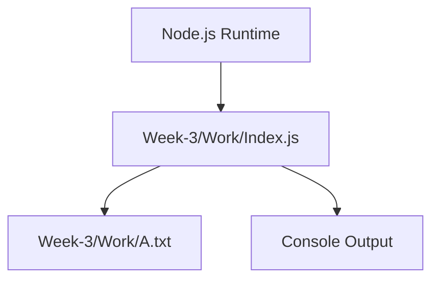
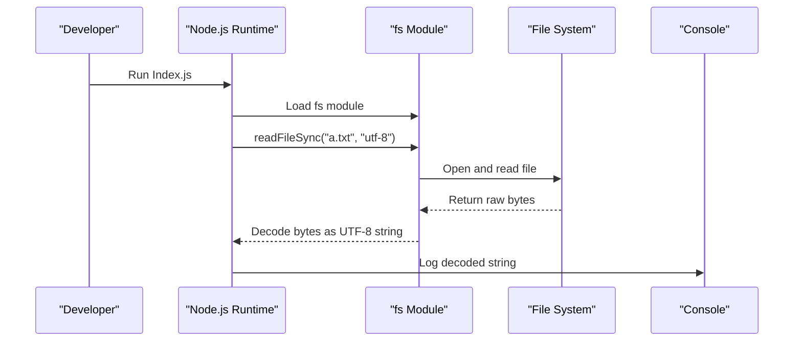
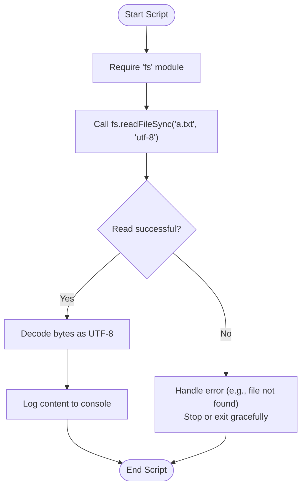
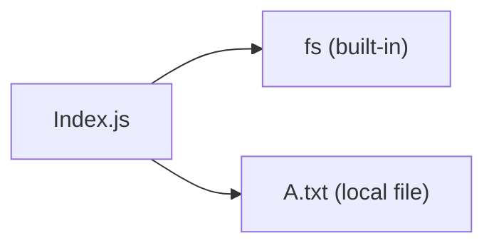

# Week 3: Node.js Introduction

<cite>
**Referenced Files in This Document**
- [Index.js](file://Week-3/Work/Index.js)
- [A.txt](file://Week-3/Work/A.txt)
</cite>

## Table of Contents
1. [Introduction](#introduction)
2. [Project Structure](#project-structure)
3. [Core Components](#core-components)
4. [Architecture Overview](#architecture-overview)
5. [Detailed Component Analysis](#detailed-component-analysis)
6. [Dependency Analysis](#dependency-analysis)
7. [Performance Considerations](#performance-considerations)
8. [Troubleshooting Guide](#troubleshooting-guide)
9. [Conclusion](#conclusion)

## Introduction
This document introduces Node.js server-side JavaScript for beginners transitioning from browser-based JavaScript. It focuses on the file system using the built-in fs module, synchronous file reading with UTF-8 encoding, and console output for debugging. You will learn how to set up a Node.js environment, resolve file paths, handle errors during file operations, and understand the differences between client-side and server-side JavaScript execution.

## Project Structure
The Week 3 workspace demonstrates a minimal Node.js example that reads a text file and prints its content to the console.

**Diagram sources**
- [Index.js:1-4](file://Week-3/Work/Index.js#L1-L4)
- [A.txt:1-1](file://Week-3/Work/A.txt#L1-L1)

**Section sources**
- [Index.js:1-4](file://Week-3/Work/Index.js#L1-L4)
- [A.txt:1-1](file://Week-3/Work/A.txt#L1-L1)

## Core Components
- File System Module (fs): Provides APIs to interact with the operating system’s file system. In this example, we use it to read a file synchronously.
- Synchronous Read with UTF-8: The code reads a text file as a string using UTF-8 encoding, ensuring correct handling of international characters.
- Console Logging: The script logs the file content to the console for quick inspection and debugging.

Key behaviors demonstrated:
- Loading the fs module via require.
- Reading a file synchronously with fs.readFileSync.
- Specifying "utf-8" encoding to interpret bytes as text.
- Printing the resulting string to the console.

**Section sources**
- [Index.js:1-4](file://Week-3/Work/Index.js#L1-L4)

## Architecture Overview
At runtime, Node.js executes the script, loads the fs module, reads the target file from disk, converts the bytes to a UTF-8 string, and outputs the result to the console.

**Diagram sources**
- [Index.js:1-4](file://Week-3/Work/Index.js#L1-L4)

## Detailed Component Analysis

### File I/O Flow with fs.readFileSync
This flow shows how the script reads a file and handles potential issues.

**Diagram sources**
- [Index.js:1-4](file://Week-3/Work/Index.js#L1-L4)

**Section sources**
- [Index.js:1-4](file://Week-3/Work/Index.js#L1-L4)

### Practical Example: Reading a Text File
- Input file: A.txt contains plain text.
- Operation: The script reads A.txt synchronously and prints its contents.
- Encoding: UTF-8 ensures proper character decoding.

Use cases:
- Quick data inspection during development.
- Configuration loading for small files.
- Learning file I/O patterns before moving to asynchronous APIs.

**Section sources**
- [Index.js:1-4](file://Week-3/Work/Index.js#L1-L4)
- [A.txt:1-1](file://Week-3/Work/A.txt#L1-L1)

### Client-Side vs Server-Side JavaScript
- Browser (client-side): Runs in the web browser; has access to DOM APIs but no direct file system access.
- Node.js (server-side): Runs outside the browser; provides access to the file system, network, and other OS-level features through modules like fs.

Implications:
- Use fs only in Node.js environments.
- Avoid browser-only APIs (like window or document) in Node.js scripts.
- Choose synchronous APIs for simple scripts; prefer asynchronous APIs for scalable applications.

[No sources needed since this section explains conceptual differences]

## Dependency Analysis
The script depends on:
- Node.js runtime to execute JavaScript outside the browser.
- Built-in fs module for file system operations.
- The local file A.txt as input data.

**Diagram sources**
- [Index.js:1-4](file://Week-3/Work/Index.js#L1-L4)
- [A.txt:1-1](file://Week-3/Work/A.txt#L1-L1)

**Section sources**
- [Index.js:1-4](file://Week-3/Work/Index.js#L1-L4)
- [A.txt:1-1](file://Week-3/Work/A.txt#L1-L1)

## Performance Considerations
- Synchronous I/O blocks the event loop; avoid in high-throughput services.
- For large files or many concurrent requests, prefer asynchronous APIs (e.g., fs.readFile or streams).
- Keep configuration files small when using synchronous reads for simplicity.

[No sources needed since this section provides general guidance]

## Troubleshooting Guide
Common issues and resolutions:
- File not found: Ensure the path is correct relative to the working directory where you run the script. If the file is missing, fs.readFileSync will throw an error.
- Permission denied: Verify that your user account has read permissions for the file.
- Encoding problems: Confirm that the file uses UTF-8 encoding; otherwise, specify the correct encoding or convert the file.
- Path resolution: When running from different directories, use absolute paths or adjust the relative path accordingly.

Recommended practices:
- Wrap file operations in try/catch to handle errors gracefully.
- Validate file existence before reading.
- Log meaningful error messages to aid debugging.

**Section sources**
- [Index.js:1-4](file://Week-3/Work/Index.js#L1-L4)

## Conclusion
This week introduced Node.js fundamentals for server-side JavaScript, focusing on file system operations with the fs module. You learned how to read a text file synchronously with UTF-8 encoding and log results to the console. As you progress, consider adopting asynchronous I/O patterns for better performance and scalability, and always handle errors robustly when interacting with the file system.

[No sources needed since this section summarizes without analyzing specific files]